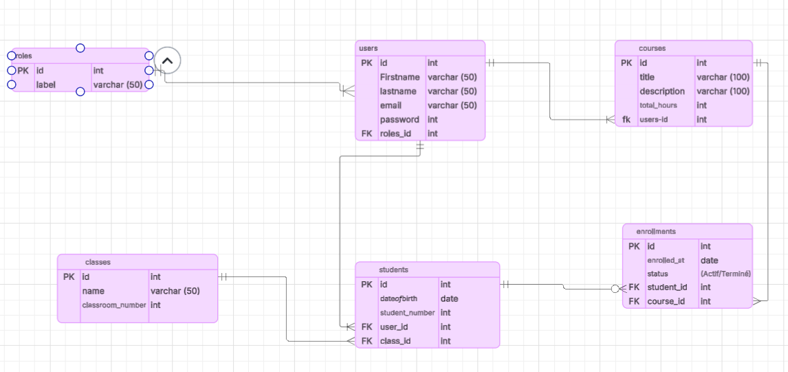

EduSync – Conception de la Base de Données 
Ce projet présente la conception d’une base de données relationnelle, normalisée et sécurisée pour un système de gestion scolaire (LMS).

Objectif:
L’objectif est de respecter les formes normales et de mettre en place des relations correctes : 1:1, 1:N et N:N.

Tables principales:
roles
users
classes
courses
students
enrollments

Explication des relations:

Relation 1 : N — roles ↔ users
Un rôle (Admin, Prof, Student) peut être attribué à plusieurs utilisateurs.
Clé étrangère : users.role_id → roles.id

Relation 1 : N — users (professeur) ↔ courses
Un professeur peut enseigner plusieurs cours.
Clé étrangère : courses.teacher_id → users.id

Relation 1 : N — classes ↔ students
Une classe contient plusieurs étudiants.
Clé étrangère : students.class_id → classes.id

Relation 1 : 1 — users ↔ students
Chaque étudiant possède un seul compte utilisateur.
Clé étrangère UNIQUE : students.user_id → users.id

Relation N : N — students ↔ courses via enrollments
Un étudiant peut suivre plusieurs cours.
Un cours peut contenir plusieurs étudiants.
Table de jointure : enrollments
FK : student_id → students.id
FK : course_id → courses.id
Contrainte : UNIQUE(student_id, course_id)

Respect de la normalisation
1FN : champs atomiques.
2FN : aucune dépendance partielle.
3FN : aucune dépendance transitive (séparation roles / users).

Conclusion

Cette conception garantit :

Une organisation claire des données
L’absence de redondance
Une évolutivité facile
Des relations logiques et cohérentes pour un système scolaire.

diagramme ERD : 

